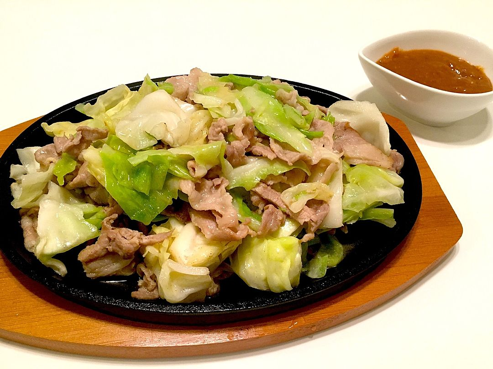

### Music on Repeat

I'm still on my nearly 3 month long Madonna deep dive and I still have almost half of her albums to go. I got through these two and "American Life" but I think I'll have to watch some music videos for that album as I wasn't too keen on it to start off with. Bedtime Stories is a relatively easy listening pop/RnB album with some hiphop and trance elements too. "Bedtime Story" the song is written by Bjork only 1 year after releating Debut! "Madonna" the self titled album is just a bunch of bops it's great.

I've had this cocteau Twins album (and like 3 others I didn't add here) on repeat and really enjoy the last track on the album called "Pur". I have two cats that are fighting due to being introduced to each other right now, so every time I listen to the song I pretend the lyrics are about them XD.

If you like electronic music and want something fun and a bit over the top, I recommend "⊿" or "Triangle" album from Pefume.

### Food and Cooking

I've been obsessed with [Nakano Darling](https://www.openstreetmap.org/node/11271537769#map=18/-33.877856/151.202439&layers=V) recently, they have this very addictive miso pork cabbage hot plate "butaniku teppan", which is rightfully advertised as "garlic max!!! oil max!!!". It comes with spoonful of spicy miso to mix in too. I first had this dish in Fukuoka at this restaurant called [Stamina Teppan Iron Man](https://hakataironman.com/) and then too was overwhemlemd by the sheer amount of oil this dish manages to get you eating.

I've been making these nice cucumber quick pickles that I didn't realise were AMAZING till I left them in the fridge for a couple days and they were 1000x better than fresh. The general idea is:

* silce in half, remove seeds, cut into little semi circles slices.
* salt to taste, and let it sit with a weight on top to get the water out for 30mins then drain.
* make marinade by putting 2 part soy, 1 part mirin, 1 part sugar on the stove (just boil lightly to get rid of the alcohol in the mirin). Add very thinly juliened ginger.
* combine so that cucumber is just submirged and sit in fridge for a couple days.

### Games

Leif and I have been playing the daily [catfishing.net](https://catfishing.net) quiz, which is this absurdly hard wikipedia trivia game where you get given the list of wikipedia tags and you have to guess the artical. If I wasn't playing with leif I would probably average a 0.5/10, but together we get around a 4/10 which surprisingly is above average. This game is not fun to play by youself, its probably not fun with 1 other person if they aren't weirdly good at trivia, it's a bit more enjoyable in a group of 3+ where you can get some varied experience to really not feel completely hopeless by the end.

*(btw, this question was a easy one!)*

### Interesting News

* [NSW Police to seize mobile phone data without a warrant](https://michaelwest.com.au/the-police-state-of-nsw-legislation-to-enable-warrant-less-phone-suriveilance/) from Michael West Media.

### Other Stuff

I've found out that you can disable shorts on Youtube by blocking "recommendations", which also means you don't have a home feed. It's been kind of fun, I have to look through my subscriptions tab or just sit and think about what I want to watch then search for it. It's a good mini-detox from social media but I still end up using reels on Instagram...

