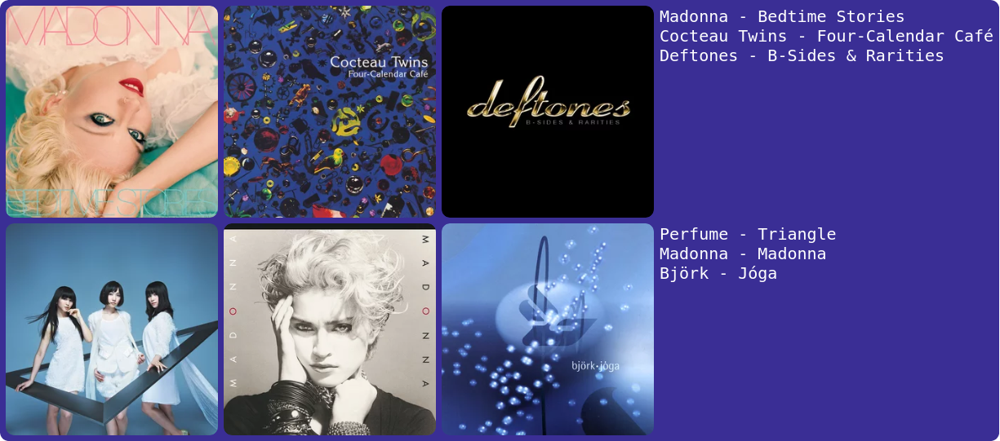
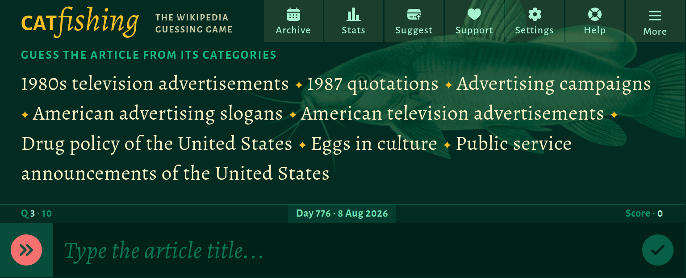

### Music on Repeat

I'm still on my nearly 3 month long Madonna deep dive and I still have almost half of her albums to go. I got through these two and "American Life" but I think I'll have to watch some music videos for that album as I wasn't too keen on it to start off with. Bedtime Stories is a super fun, easy listening RnB album with some hiphop and trance elements too. "Bedtime Story" the song is written by Bjork only 1 year after releating Debut! "Madonna" the self titled album is just a bunch of bops also very easy listening.

I've had this cocteau Twins album (and like 3 others I didn't add here) on repeat and really enjoy the last track on the album called "Pur".

I've listened to a bit of Perfume in the past and wasn't too keen on it, but I must have missed Triangle since its sooo much fun! It's just 

### Games

Leif and I have been playing alot of [catfishing.net](https://catfishing.net), which is this absurdly hard wikipedia trivia game where you get given the list of wikipedia tags and you have to guess the artical. If i wasn't playing with leif I would probably average a 0.5/10, but together we get around a 4 or 5/10 which surprisingly is above average. This game is not fun if you are bad at general knowledge and don't have a Leif at your disposal, it's a bit more enjoyable in a group of 3+ where you can get some varied experience to really not feel completely hopeless.

### Interesting News

* [NSW Police to seize mobile phone data without a warrant](https://michaelwest.com.au/the-police-state-of-nsw-legislation-to-enable-warrant-less-phone-suriveilance/) from Michael West Media.

### Other Stuff

I've found out that you can disable shorts on Youtube by blocking "recommendations", which also means you don't have a home feed. It's been kind of fun, I have to look through my subscriptions tab or just sit and think about what I want to watch then search for it. It's a good mini-detox from social media but I still end up using reels on Instagram...
